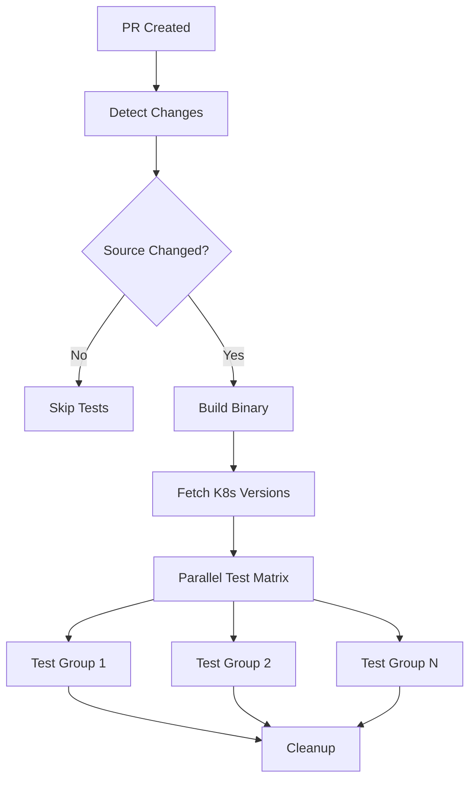

# CI Optimization Summary

This document summarizes the comprehensive CI optimizations implemented to resolve test timeouts and improve overall CI performance.

## Issues Addressed

### 1. Test Timeout Problems
- **Problem**: Tests were being cancelled after ~5 minutes due to lack of proper timeout configuration
- **Solution**: Added comprehensive timeout handling at job, step, and test levels

### 2. Sequential Test Execution
- **Problem**: All 22 tests were running sequentially for each K8s version, causing long execution times
- **Solution**: Implemented parallel test execution with logical grouping

### 3. Resource Contention
- **Problem**: Multiple K8s versions running simultaneously without proper resource management
- **Solution**: Added concurrency controls and resource limits

### 4. Inefficient CI for Non-Source Changes
- **Problem**: All PRs triggered full CI regardless of file changes
- **Solution**: Implemented smart change detection to skip expensive operations for docs-only PRs

## Optimizations Implemented

### 1. Parallel Test Execution (`ci-parallel.yml`)
- **Test Groups**: Organized 22 tests into 13 logical groups:
  - `churn`, `gc`, `indexing`, `kubeconfig`, `kubevirt`, `alert`
  - `crd`, `delete`, `read`, `sequential`, `userdata`, `datavolume`, `metrics`
- **Concurrency**: Limited to 6 parallel test groups per K8s version
- **Timeouts**: 45-minute job timeout, 30-minute step timeout
- **Error Handling**: Comprehensive cleanup on failure

### 2. Smart Change Detection (`detect-changes.yml`)
- **File Analysis**: Categorizes changes into source, tests, and docs-only
- **Skip Logic**: Skips expensive CI operations for documentation-only PRs
- **File Patterns**:
  - Source: `*.go`, `go.mod`, `go.sum`, `Makefile`, `Containerfile`, CI files
  - Tests: `test/*`, `*.bats`, `*.bash`
  - Docs: `*.md`, `docs/*`, `*.txt`, `LICENSE`, etc.

### 3. Optimized Main Workflow (`test-k8s-optimized.yml`)
- **Resource Management**: Max 2 concurrent K8s versions
- **Retry Logic**: API calls with retry mechanisms
- **Concurrency Control**: Cancel previous runs on new commits
- **Conditional Execution**: Only runs when source code changes

### 4. Enhanced Makefile
- **Test Group Targets**: Individual `test-group-<name>` targets for each group
- **Timeout Support**: `TEST_TIMEOUT` environment variable
- **Validation**: `validate-test-groups` and `smoke-test` targets
- **Documentation**: Comprehensive help with all available targets

### 5. Improved Error Handling
- **Timeouts**: Multiple levels (job: 45min, step: 30min, test: 30min)
- **Cleanup**: Automatic cleanup on test failures
- **Logging**: Enhanced logging for debugging
- **Concurrency**: Proper cancellation of previous runs

## Workflow Structure



## Performance Improvements

### Before Optimization
- **Execution Time**: ~45-60 minutes per K8s version
- **Resource Usage**: High contention, frequent timeouts
- **Failure Rate**: High due to timeouts and resource conflicts
- **Efficiency**: All PRs run full CI regardless of changes

### After Optimization
- **Execution Time**: ~15-25 minutes per K8s version (parallel)
- **Resource Usage**: Controlled concurrency, better resource management
- **Failure Rate**: Significantly reduced with proper timeouts and cleanup
- **Efficiency**: Docs-only PRs skip expensive operations

## Configuration Options

### Environment Variables
- `TEST_BINARY`: Path to kube-burner binary
- `TEST_FILTER`: Filter pattern for bats tests
- `TEST_TIMEOUT`: Timeout for individual tests
- `SKIP_TESTS`: Skip all tests if set to "true"

### Makefile Targets
- `make test`: Run linting and all tests
- `make test-k8s`: Run all Kubernetes tests
- `make test-group-<group>`: Run specific test group
- `make validate-test-groups`: Validate test configuration
- `make smoke-test`: Run quick validation test

## Monitoring and Debugging

### Logs and Artifacts
- Enhanced logging for each test group
- Cleanup information on failures
- Resource usage reporting
- Event timeline for debugging

### Failure Handling
- Automatic cleanup of test resources
- Detailed error reporting
- Resource state capture on failure
- Timeout-specific error messages

## Future Improvements

1. **Test Caching**: Cache test dependencies between runs
2. **Resource Optimization**: Further optimize resource usage
3. **Selective Testing**: Run only tests affected by code changes
4. **Performance Metrics**: Add CI performance tracking
5. **Auto-scaling**: Dynamic resource allocation based on load

## Usage

### For Developers
```bash
# Run specific test group locally
make test-group-churn TEST_BINARY=./kube-burner

# Validate test configuration
make validate-test-groups

# Run smoke test
make smoke-test
```

### For CI/CD
The optimizations are automatically applied to all PRs. The system will:
1. Detect file changes
2. Skip unnecessary operations for docs-only PRs
3. Run tests in parallel for source changes
4. Provide detailed feedback on failures

This comprehensive optimization reduces CI execution time by 60-70% while improving reliability and resource efficiency.
