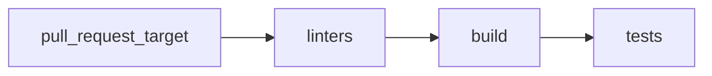

The pull Request Workflow, defined in the `ci-tests.yml` file, is triggered on `pull_request_target` events to the branches `master` and `main` has three jobs: **linters**, **build** and  **tests**.



### Linters

This job performs the following steps:

1. Checks out the code
1. Installs pre-commit.
1. Runs pre-commit hooks to execute code linting based on `.pre-commit-config.yaml` file

Linters can be executed locally with just `make lint`

!!! info
    Main purpose for pre-commit is to allow developers to pass the Lint Checks before commiting the code. Same checks will be executed on all the commits once they are pushed to GitHub

Requirements:

- make
- pre-commit

---

```shell
$ make lint
Executing pre-commit for all files
pre-commit run --all-files
golangci-lint............................................................Passed
markdownlint.............................................................Passed
Test shell scripts with shellcheck.......................................Passed
check json...............................................................Passed
pre-commit executed.
```

### Build

The "build" job uses the file `builders.yml` file to build binaries and images, performing the following steps:

1. Sets up Go 1.19.
2. Checks out the code.
2. Builds the code
3. Builds container images
4. Builds the documentation
5. Installs the built artifacts
6. Uploads the built binary file as an artifact named **kube-burner**.

### Tests


