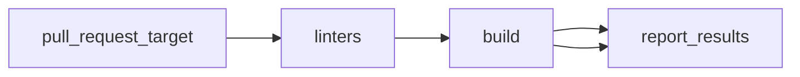

The pull Request Workflow, defined in the `pullrequest.yml` file, is triggered on `pull_request_target` events to the branches `master` and `main`. It has three jobs: **linters**, **build**, **tests**, and **report_results**.



### Linters

This job performs the following steps:

1. Checks out the code
1. Installs pre-commit.
1. Runs pre-commit hooks to execute code linting based on `.pre-commit-config.yaml` file

#### Running local pre-commit

!!! info
    Main purpose for pre-commit is to allow developers to pass the Lint Checks before commiting the code. Same checks will be executed on all the commits once they are pushed to GitHub

---

To install pre-commit checks locally, follow these steps:

1. Install [pre-commit](https://pre-commit.com/) by running the following command:

    ```console
    pip install pre-commit
    ```

1. `ruby` is required for running the Markdown Linter, installation will depends on your Operating System, for example, on Fedora:

    ```console
    dnf install -y ruby
    ```

1. Initialize pre-commit on the repo:

    ```console
    pre-commit install
    ```

---

To run pre-commit manually for all files, you can use `make lint`

  ```console
  make lint
  ```

Or you can run against an especific file:

```console
$ pre-commit run --files README.md
golangci-lint........................................(no files to check)Skipped
Markdownlint.............................................................Passed
```

```console
$ pre-commit run --files ./cmd/kube-burner/kube-burner.go
golangci-lint............................................................Passed
Markdownlint.........................................(no files to check)Skipped
```

```console
$ pre-commit run --all-files
golangci-lint............................................................Passed
Markdownlint.............................................................Passed
```

Pre-commit hooks can be updated using `pre-commit autoupdate`:

```console
$ pre-commit autoupdate
[WARNING] The 'rev' field of repo 'https://github.com/golangci/golangci-lint' appears to be a mutable reference (moving tag / branch).  Mutable references are never updated after first install and are not supported.  See https://pre-commit.com/#using-the-latest-version-for-a-repository for more details.  Hint: `pre-commit autoupdate` often fixes this.
[WARNING] The 'rev' field of repo 'https://github.com/markdownlint/markdownlint' appears to be a mutable reference (moving tag / branch).  Mutable references are never updated after first install and are not supported.  See https://pre-commit.com/#using-the-latest-version-for-a-repository for more details.  Hint: `pre-commit autoupdate` often fixes this.
[WARNING] The 'rev' field of repo 'https://github.com/jumanjihouse/pre-commit-hooks' appears to be a mutable reference (moving tag / branch).  Mutable references are never updated after first install and are not supported.  See https://pre-commit.com/#using-the-latest-version-for-a-repository for more details.  Hint: `pre-commit autoupdate` often fixes this.
[https://github.com/golangci/golangci-lint] updating master -> v1.52.2
[https://github.com/markdownlint/markdownlint] updating master -> v0.12.0
[https://github.com/jumanjihouse/pre-commit-hooks] updating master -> 3.0.0
```

### Build

The "build" job uses the file `builders.yml` file to build binaries and images, performing the following steps:

1. Sets up Go 1.19.
1. Checks out the code.
1. Builds the code using the `make build` command.
1. Builds container images using the `make images` command
1. Installs the built artifacts using `sudo make install` command.
1. Uploads the built binary file as an artifact named **kube-burner**.

### Tests



### Report Results

The "report_results" job performs the following steps:

1. Checks out the code.
1. Downloads the Kubernetes and OpenShift test results artifacts.
1. Publishes the test results and add a comment in the PR
