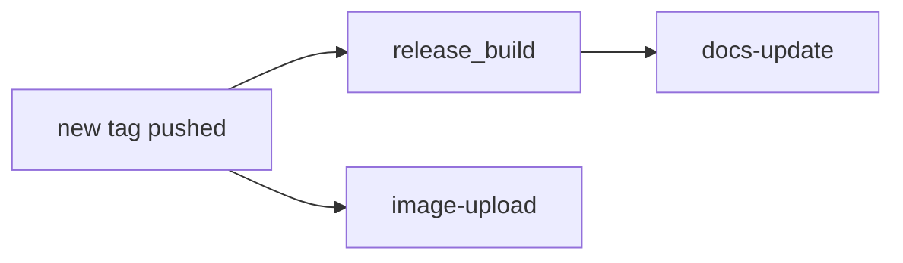

The Release workflow, defined in the `release.yml` file, when a new tag is pushed it triggers: **release-build** and **image-upload**.

The `docs-update` job is triggered when a new release is `published`, this is done by the `release_build` job.

#### Release Build

This job uses the GoRelease workflow defined in the `gorelease.yml` file to create a new release of the project performing the following steps:

1. Checks out the code into the Go module directory.
1. Sets up Go 1.19.
1. Runs GoReleaser to create a new release, including the removal of previous distribution files.

#### Image Upload

This job uses the Upload Containers to Quay workflow defined in the `image-upload.yml` file to upload containers to the Quay registry for multiple architectures (arm64, amd64, ppc64le, s390x) performing the following steps:

1. Installs the dependencies required for multi-architecture builds.
1. Checks out the code.
1. Sets up Go 1.19.
1. Logs in to Quay using the provided QUAY_USER and QUAY_TOKEN secrets.
1. Builds the kube-burner binary for the specified architecture.
1. Builds the container image using the make images command, with environment variables for architecture and organization.
1. Pushes the container image to Quay using the make push command.

The "manifest" job builds a container manifest and runs after the "containers" job. It performs the following steps:

1. Checks out the code.
1. Logs in to Quay using the provided QUAY_USER and QUAY_TOKEN secrets.
1. Creates and pushes the container manifest using the make manifest command, with the organization specified.

#### Docs Update

Uses the `Deploy docs` workflow defined in the `docs.yml` file to generate and deploy the documentation performing the following steps:

1. Checks out the code.
1. Sets up Python 3.x.
1. Exports the release tag version as an environment variable.
1. Sets up the Git configuration for documentation deployment.
1. Installs the required dependencies, including mkdocs-material and mike.
1. Deploys the documentation using the mike deploy command, with specific parameters for updating aliases and including the release tag version in the deployment message.
