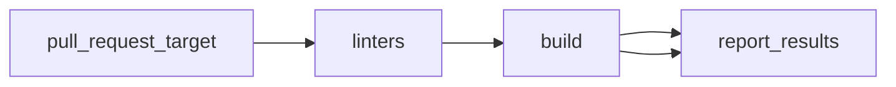
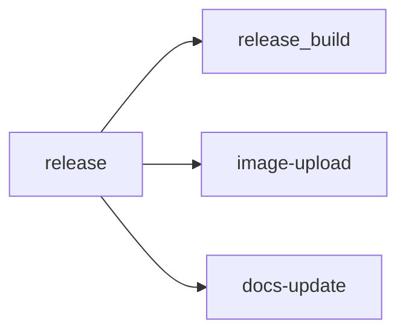

### Pull Request Workflow

```mermaid
graph LR
  A[pull_request_target] --> B[linters];
  B --> C[build];
  C --> D[tests];
  C --> D[report_results];
```

### Release Workflow

```mermaid
graph LR
  A[release] --> B[release_build];
  A --> C[image-upload];
  A --> D[docs-update];
```
