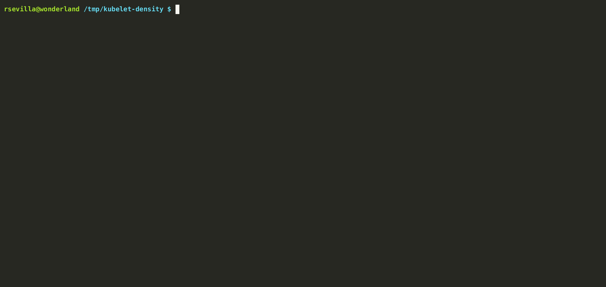

# What is Kube-burner

Kube-burner is a Kubernetes performance toolset. It provides multiple functionalities where the most hightliged can be summarized in:

- Create, delete and patch Kubernetes at scale.
- Prometheus metric collection and indexing.
- Measurements.
- Alerting.

Kube-burner is a binary application written in golang that makes an intensive usage of the official k8s client library, [client-go](https://github.com/kubernetes/client-go).

# Quick starting with Kube-burner

In case you want to start tinkering with Kube-burner now:

- Find binaries for different CPU architectures and operating systems in the [releases section of the repository](https://github.com/cloud-bulldozer/kube-burner/releases).
- There's also a container image repository available at [quay](https://quay.io/repository/cloud-bulldozer/kube-burner?tab=tags).
- Some valid examples of configuration files, metrics profiles and grafana dashboards can be found in the [examples directory](https://github.com/cloud-bulldozer/kube-burner/tree/master/examples) of the repository.
