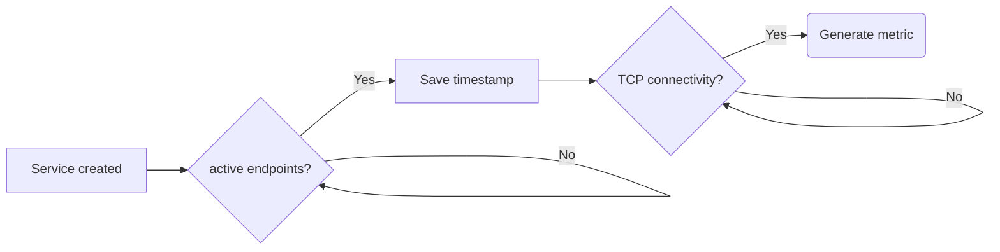

# Measurements

Kube-burner allows you to get further metrics using other mechanisms or data sources, such as the Kubernetes API. These mechanisms are called measurements.

Measurements are enabled in the `measurements` object of the configuration file. This object contains a list of measurements with their options.

## Pod latency

Collects latencies from the different pod startup phases, these **latency metrics are in ms**. It can be enabled with:

```yaml
  measurements:
  - name: podLatency
```

### Metrics

The metrics collected are pod latency timeeries (`podLatencyMeasurement`) and four documents holding a summary with different pod latency quantiles of each pod condition (`podLatencyQuantilesMeasurement`).

One document, such as the following, is indexed per each pod created by the workload that enters in `Running` condition during the workload:

```json
{
  "timestamp": "2020-11-15T20:28:59.598727718Z",
  "schedulingLatency": 4,
  "initializedLatency": 20,
  "containersReadyLatency": 2997,
  "podReadyLatency": 2997,
  "metricName": "podLatencyMeasurement",
  "uuid": "c40b4346-7af7-4c63-9ab4-aae7ccdd0616",
  "namespace": "kubelet-density",
  "podName": "kubelet-density-13",
  "nodeName": "worker-001",
  "jobConfig": {"config": "params"}
}
```

---

Pod latency quantile sample:

```json
{
  "quantileName": "Ready",
  "uuid": "23c0b5fd-c17e-4326-a389-b3aebc774c82",
  "P99": 3774,
  "P95": 3510,
  "P50": 2897,
  "max": 3774,
  "avg": 2876.3,
  "timestamp": "2020-11-15T22:26:51.553221077+01:00",
  "metricName": "podLatencyQuantilesMeasurement",
  "jobConfig": {
    "config": "params"
  }
},
{
  "quantileName": "PodScheduled",
  "uuid": "23c0b5fd-c17e-4326-a389-b3aebc774c82",
  "P99": 64,
  "P95": 8,
  "P50": 5,
  "max": 64,
  "avg": 5.38,
  "timestamp": "2020-11-15T22:26:51.553225151+01:00",
  "metricName": "podLatencyQuantilesMeasurement",
  "jobConfig": {
    "config": "params"
  }
}
```

Where `quantileName` matches with the pod conditions and can be:

- `PodScheduled`: Pod has been scheduled in to a node.
- `Initialized`: All init containers in the pod have started successfully
- `ContainersReady`: Indicates whether all containers in the pod are ready.
- `Ready`: The pod is able to service requests and should be added to the load balancing pools of all matching services.

!!! note
    We also log the errorRate of the latencies for user's understanding. It indicates the percentage of pods out of all pods in the workload that got errored during the latency calculations. Currently the threshold for the errorRate is 10% and we do not log latencies if the error is > 10% which indicates a problem with environment.(i.e system under test)

!!! info
    More information about the pod conditions can be found at the [kubernetes documentation site](https://kubernetes.io/docs/concepts/workloads/pods/pod-lifecycle/#pod-conditions).

And the metrics are:

- `P99`: 99th percentile of the pod condition.
- `P95`: 95th percentile of the pod condition.
- `P50`: 50th percentile of the pod condition.
- `Max`: Maximum value of the condition.
- `Avg`: Average value of the condition.

### Pod latency thresholds

It is possible to establish pod latency thresholds to the different pod conditions and metrics by defining the option `thresholds` within this measurement:

Establishing a threshold of 2000ms in the P99 metric of the `Ready` condition.

```yaml
  measurements:
  - name: podLatency
    thresholds:
    - conditionType: Ready
      metric: P99
      threshold: 2000ms
```

Latency thresholds are evaluated at the end of each job, showing an informative message like the following:

```console
INFO[2020-12-15 12:37:08] Evaluating latency thresholds
WARN[2020-12-15 12:37:08] P99 Ready latency (2929ms) higher than configured threshold: 2000ms
```

In case of not meeting any of the configured thresholds, like the example above, **kube-burner return code will be 1**.

### Measure subcommand CLI example
Measure subcommand example with relevant options. It is used to fetch measurements on top of resources that were a part of workload ran in past.
```
kube-burner measure --uuid=vchalla --namespaces=cluster-density-v2-0,cluster-density-v2-1,cluster-density-v2-2,cluster-density-v2-3,cluster-density-v2-4 --selector=kube-burner-job=cluster-density-v2 
time="2023-11-19 17:46:05" level=info msg="📁 Creating indexer: elastic" file="kube-burner.go:226"
time="2023-11-19 17:46:05" level=info msg="map[kube-burner-job:cluster-density-v2]" file="kube-burner.go:247"
time="2023-11-19 17:46:05" level=info msg="📈 Registered measurement: podLatency" file="factory.go:85"
time="2023-11-19 17:46:06" level=info msg="Stopping measurement: podLatency" file="factory.go:118"
time="2023-11-19 17:46:06" level=info msg="Evaluating latency thresholds" file="metrics.go:60"
time="2023-11-19 17:46:06" level=info msg="Indexing pod latency data for job: kube-burner-measure" file="pod_latency.go:245"
time="2023-11-19 17:46:07" level=info msg="Indexing finished in 417ms: created=4" file="pod_latency.go:262"
time="2023-11-19 17:46:08" level=info msg="Indexing finished in 1.32s: created=50" file="pod_latency.go:262"
time="2023-11-19 17:46:08" level=info msg="kube-burner-measure: PodScheduled 50th: 0 99th: 0 max: 0 avg: 0" file="pod_latency.go:233"
time="2023-11-19 17:46:08" level=info msg="kube-burner-measure: ContainersReady 50th: 9000 99th: 18000 max: 18000 avg: 10680" file="pod_latency.go:233"
time="2023-11-19 17:46:08" level=info msg="kube-burner-measure: Initialized 50th: 0 99th: 0 max: 0 avg: 0" file="pod_latency.go:233"
time="2023-11-19 17:46:08" level=info msg="kube-burner-measure: Ready 50th: 9000 99th: 18000 max: 18000 avg: 10680" file="pod_latency.go:233"
time="2023-11-19 17:46:08" level=info msg="Pod latencies error rate was: 0.00" file="pod_latency.go:236"
time="2023-11-19 17:46:08" level=info msg="👋 Exiting kube-burner vchalla" file="kube-burner.go:209"
```

## Service latency

Calculates the time taken the services to serve requests once their endpoints are ready. This measurement works as follows.



Where the service latency is the time elapsed since the service has at least one endpoint ready till the connectivity is verified.

The connectivity check is done through a pod running in the `kube-burner-service-latency` namespace, kube-burner connects to this pod and uses `netcat` to verify connectivity.

This measure is enabled with:

```yaml
  measurements:
  - name: serviceLatency 
    svcTimeout: 5s
```

Where `svcTimeout`, by default `5s`, defines the maximum amount of time the measurement will wait for a service to be ready, when this timeout is met, the metric from that service is **discarded**.

!!! warning "Considerations"
    - Only TCP is supported.
    - Supported services are `ClusterIP`, `NodePort` and `LoadBalancer`.
    - kube-burner starts checking service connectivity when its endpoints object has at least one address.
    - Make sure the endpoints of the service are correct and reachable from the pod running in the `kube-burner-service-latency`.
    - When the service is `NodePort`, the connectivity check is done against the node where the connectivity check pods runs.
    - By default all services created by the benchmark are tracked by this measurement, it's possible to discard service objects from tracking by annotating them with `kube-burner.io/service-latency=false`.
    - Keep in mind that When service is `LoadBalancer` type, the provider needs to setup the load balancer, which adds some extra delay.
    - Endpoints are pinged one after another, this can create some delay when the number of endpoints of the service is big.

### Metrics

The metrics collected are service latency timeseries (`svcLatencyMeasurement`) and another document that holds a summary with the different service latency quantiles (`svcLatencyQuantilesMeasurement`). It is possible to skip indexing the `svcLatencyMeasurement` metric by configuring the field `svcLatencyMetrics` of this measurement to `quantiles`. Metric documents have the following structure:

```json
{
  "timestamp": "2023-11-19T00:41:51Z",
  "ready": 1631880721,
  "metricName": "svcLatencyMeasurement",
  "jobConfig": {
    "config": "params"
  },
  "uuid": "c4558ba8-1e29-4660-9b31-02b9f01c29bf",
  "namespace": "cluster-density-v2-2",
  "service": "cluster-density-1",
  "type": "ClusterIP"
}
```

!!! note
    When type is `LoadBalancer`, it includes an extra field `ipAssigned`, that reports the IP assignation latency of the service.

And the quantiles document has the structure:

```json
{
  "quantileName": "Ready",
  "uuid": "c4558ba8-1e29-4660-9b31-02b9f01c29bf",
  "P99": 1867593282,
  "P95": 1856488440,
  "P50": 1723817691,
  "max": 1868307027,
  "avg": 1722308938,
  "timestamp": "2023-11-19T00:42:26.663991359Z",
  "metricName": "svcLatencyQuantilesMeasurement",
  "jobConfig": {
    "config": "params"
  }
},
{
  "quantileName": "LoadBalancer",
  "uuid": "c4558ba8-1e29-4660-9b31-02b9f01c29bf",
  "P99": 1467593282,
  "P95": 1356488440,
  "P50": 1323817691,
  "max": 2168307027,
  "avg": 1822308938,
  "timestamp": "2023-11-19T00:42:26.663991359Z",
  "metricName": "svcLatencyQuantilesMeasurement",
  "jobConfig": {
    "config": "params"
  }
}
```

When there're `LoadBalancer` services, an extra document with `quantileName` as `LoadBalancer` is also generated as shown above.

## pprof collection

This measurement can be used to collect Golang profiling information from processes running in pods from the cluster. To do so, kube-burner connects to pods labeled with `labelSelector` and running in `namespace`. This measurement uses an implementation similar to `kubectl exec`, and as soon as it connects to one pod it executes the command `curl <pprofURL>` to get the pprof data. pprof files are collected in a regular basis configured by the parameter `pprofInterval`, the collected pprof files are downloaded from the pods to the local directory configured by the parameter `pprofDirectory` which by default is `pprof`.

As some components require authentication to get profiling information, `kube-burner` provides two different modalities to address it:

- **Bearer token authentication**: This modality is configured by the variable `bearerToken`, which holds a valid Bearer token that will be used by cURL to get pprof data. This method is usually valid with kube-apiserver and kube-controller-managers components
- **Certificate Authentication**: Usually valid for etcd, this method can be configured using a combination of cert/privKey files or directly using the cert/privkey content, it can be tweaked with the following variables:
    - `cert`: Base64 encoded certificate.
    - `key`: Base64 encoded private key.
    - `certFile`: Path to a certificate file.
    - `keyFile`: Path to a private key file.

!!! note
    The decoded content of the certificate and private key is written to the files /tmp/pprof.crt and /tmp/pprof.key of the remote pods respectively

An example of how to configure this measurement to collect pprof HEAP and CPU profiling data from kube-apiserver and etcd is shown below:

```yaml
  measurements:
  - name: pprof
    pprofInterval: 30m
    pprofDirectory: pprof-data
    pprofTargets:
    - name: kube-apiserver-heap
      namespace: "openshift-kube-apiserver"
      labelSelector: {app: openshift-kube-apiserver}
      bearerToken: thisIsNotAValidToken
      url: https://localhost:6443/debug/pprof/heap

    - name: etcd-heap
      namespace: "openshift-etcd"
      labelSelector: {app: etcd}
      certFile: etcd-peer-pert.crt
      keyFile: etcd-peer-pert.key
      url: https://localhost:2379/debug/pprof/heap
```

!!! warning
    As mentioned before, this measurement requires the `curl` command to be available in the target pods.
