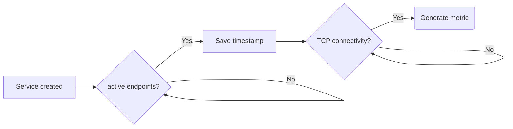

# Measurements

Kube-burner allows you to get further metrics using other mechanisms or data sources, such as the Kubernetes API. These mechanisms are called measurements.

Measurements are enabled in the `measurements` object of the configuration file. This object contains a list of measurements with their options.

## Pod latency

Collects latencies from the different pod startup phases, these **latency metrics are in ms**. It can be enabled with:

```yaml
  measurements:
  - name: podLatency
```

### Metrics

The metrics collected are pod latency timeseries (`podLatencyMeasurement`) and four documents holding a summary with different pod latency quantiles of each pod condition (`podLatencyQuantilesMeasurement`).

One document, such as the following, is indexed per each pod created by the workload that enters in `Running` condition during the workload:

```json
{
  "timestamp": "2020-11-15T20:28:59.598727718Z",
  "schedulingLatency": 4,
  "initializedLatency": 20,
  "containersReadyLatency": 2997,
  "podReadyLatency": 2997,
  "metricName": "podLatencyMeasurement",
  "uuid": "c40b4346-7af7-4c63-9ab4-aae7ccdd0616",
  "namespace": "kubelet-density",
  "podName": "kubelet-density-13",
  "nodeName": "worker-001",
  "jobName": "create-pods",
  "jobIteration": "2",
  "replica": "3",
}
```

---

Pod latency quantile sample:

```json
{
  "quantileName": "Ready",
  "uuid": "23c0b5fd-c17e-4326-a389-b3aebc774c82",
  "P99": 3774,
  "P95": 3510,
  "P50": 2897,
  "max": 3774,
  "avg": 2876.3,
  "timestamp": "2020-11-15T22:26:51.553221077+01:00",
  "metricName": "podLatencyQuantilesMeasurement",
},
{
  "quantileName": "PodScheduled",
  "uuid": "23c0b5fd-c17e-4326-a389-b3aebc774c82",
  "P99": 64,
  "P95": 8,
  "P50": 5,
  "max": 64,
  "avg": 5.38,
  "timestamp": "2020-11-15T22:26:51.553225151+01:00",
  "metricName": "podLatencyQuantilesMeasurement",
}
```

Where `quantileName` matches with the pod conditions and can be:

- `PodScheduled`: Pod has been scheduled in to a node.
- `PodReadyToStartContainers`: The Pod sandbox has been successfully created and networking configured.
- `Initialized`: All init containers in the pod have started successfully
- `ContainersReady`: Indicates whether all containers in the pod are ready.
- `Ready`: The pod is able to service requests and should be added to the load balancing pools of all matching services.

!!! note
    We also log the errorRate of the latencies for user's understanding. It indicates the percentage of pods out of all pods in the workload that got errored during the latency calculations. Currently the threshold for the errorRate is 10% and we do not log latencies if the error is > 10% which indicates a problem with environment.(i.e system under test)

!!! info
    More information about the pod conditions can be found at the [kubernetes documentation site](https://kubernetes.io/docs/concepts/workloads/pods/pod-lifecycle/#pod-conditions).

And the metrics are:

- `P99`: 99th percentile of the pod condition.
- `P95`: 95th percentile of the pod condition.
- `P50`: 50th percentile of the pod condition.
- `Max`: Maximum value of the condition.
- `Avg`: Average value of the condition.

### Pod latency thresholds

It is possible to establish pod latency thresholds to the different pod conditions and metrics by defining the option `thresholds` within this measurement:

Establishing a threshold of 2000ms in the P99 metric of the `Ready` condition.

```yaml
  measurements:
  - name: podLatency
    thresholds:
    - conditionType: Ready
      metric: P99
      threshold: 2000ms
```

Latency thresholds are evaluated at the end of each job, showing an informative message like the following:

```console
INFO[2020-12-15 12:37:08] Evaluating latency thresholds
WARN[2020-12-15 12:37:08] P99 Ready latency (2929ms) higher than configured threshold: 2000ms
```

In case of not meeting any of the configured thresholds, like the example above, **kube-burner return code will be 1**.

## Job latency

Collects latencies from the different job stages, these **latency metrics are in ms**. It can be enabled with:

```yaml
  measurements:
  - name: jobLatency
```

### Metrics

The metrics collected are pod latency timeseries (`jobLatencyMeasurement`) and two documents holding a summary of different job latency quantiles (`jobLatencyQuantilesMeasurement`).

It generates a document like the following per each job:

```json
  {
    "timestamp": "2025-05-07T10:31:03Z",
    "startTimeLatency": 0,
    "completionLatency": 14000,
    "metricName": "jobLatencyMeasurement",
    "uuid": "62d3c7a1-4faa-44fb-99ff-cf2b79cdfd22",
    "jobName": "small",
    "jobIteration": 0,
    "replica": 18,
    "namespace": "kueue-scale-s",
    "k8sJobName": "kueue-scale-small-18",
    "metadata": {
      "ocpMajorVersion": "4.18",
      "ocpVersion": "4.18.5"
    }
  }
```

Where `completionLatency` and `starTimeLatency` indicate the job completion time and startup latency respectively since its creation timestamp.


Jobod latency quantile sample:

```json
[
  {
    "quantileName": "StartTime",
    "uuid": "62d3c7a1-4faa-44fb-99ff-cf2b79cdfd22",
    "P99": 0,
    "P95": 0,
    "P50": 0,
    "min": 0,
    "max": 0,
    "avg": 0,
    "timestamp": "2025-05-07T10:31:22.181506023Z",
    "metricName": "jobLatencyQuantilesMeasurement",
    "jobName": "small",
    "metadata": {
      "ocpMajorVersion": "4.18",
      "ocpVersion": "4.18.5"
    }
  },
  {
    "quantileName": "Complete",
    "uuid": "62d3c7a1-4faa-44fb-99ff-cf2b79cdfd22",
    "P99": 15000,
    "P95": 15000,
    "P50": 14000,
    "min": 13000,
    "max": 15000,
    "avg": 13950,
    "timestamp": "2025-05-07T10:31:22.181509954Z",
    "metricName": "jobLatencyQuantilesMeasurement",
    "jobName": "small",
    "metadata": {
      "ocpMajorVersion": "4.18",
      "ocpVersion": "4.18.5"
    }
  }
]
```

## VMI latency

Collects latencies from the different vm/vmi startup phases, these **latency metrics are in ms**. It can be enabled with:

```yaml
  measurements:
  - name: vmiLatency
```

### Metrics

The metrics collected are vm/vmi latency timeseries (`vmiLatencyMeasurement`) and up to 10 documents holding a summary with different vm/vmi latency quantiles of each condition (`vmiLatencyQuantilesMeasurement`).

One document, such as the following, is indexed per each vm/vmi created by the workload that enters in `Running` condition during the workload:

```json
{
    "timestamp": "2024-11-26T12:57:50Z",
    "podCreatedLatency": 116532,
    "podScheduledLatency": 116574,
    "podInitializedLatency": 132511,
    "podContainersReadyLatency": 135541,
    "podReadyLatency": 135541,
    "vmiCreatedLatency": 7000,
    "vmiPendingLatency": 116401,
    "vmiSchedulingLatency": 117106,
    "vmiScheduledLatency": 127926,
    "vmiRunningLatency": 138166,
    "vmReadyLatency": 138166,
    "metricName": "vmiLatencyMeasurement",
    "uuid": "f7c79fd5-58e7-4719-a710-7633ffb20491",
    "namespace": "virt-density",
    "podName": "virt-launcher-virt-density-27-zkfdt",
    "vmName": "virt-density-27",
    "vmiName": "virt-density-27",
    "nodeName": "y37-h25-000-r740xd",
    "jobName": "virt-density",
}
```

!!! info
    The fields `vmReadyLatency` and `vmName` are only set when the VMI has a parent VM object

!!! info
    The fields prefixed by `pod`, represent the latency of the different startup phases of the pod running the actual virtual machine.

---

Pod latency quantile sample:

```json
[
  {
    "quantileName": "PodPodScheduled",
    "uuid": "f7c79fd5-58e7-4719-a710-7633ffb20491",
    "P99": 125183,
    "P95": 124870,
    "P50": 119769,
    "max": 125313,
    "avg": 119509,
    "timestamp": "2024-11-26T13:00:30.713169517Z",
    "metricName": "vmiLatencyQuantilesMeasurement",
    "jobName": "virt-density",
  },
  {
    "quantileName": "VMIScheduled",
    "uuid": "f7c79fd5-58e7-4719-a710-7633ffb20491",
    "P99": 144029,
    "P95": 143255,
    "P50": 139240,
    "max": 144029,
    "avg": 138699,
    "timestamp": "2024-11-26T13:00:30.713173817Z",
    "metricName": "vmiLatencyQuantilesMeasurement",
    "jobName": "virt-density",
  },
  {
    "quantileName": "PodContainersReady",
    "uuid": "f7c79fd5-58e7-4719-a710-7633ffb20491",
    "P99": 144029,
    "P95": 143257,
    "P50": 139466,
    "max": 144030,
    "avg": 139361,
    "timestamp": "2024-11-26T13:00:30.713179584Z",
    "metricName": "vmiLatencyQuantilesMeasurement",
    "jobName": "virt-density",
  },
]

```

## Node latency

Collects latencies from the different node conditions on the cluster, these **latency metrics are in ms**. It can be enabled with:

```yaml
  measurements:
  - name: nodeLatency
```

### Metrics

The metrics collected are node latency timeseries (`nodeLatencyMeasurement`) and four documents holding a summary with different node latency quantiles of each node condition (`nodeLatencyQuantilesMeasurement`).

One document, such as the following, is indexed per each node created by the workload that enters in `Ready` condition during the workload:

```json
{
  "timestamp": "2024-08-25T12:49:26Z",
  "nodeMemoryPressureLatency": 0,
  "nodeDiskPressureLatency": 0,
  "nodePIDPressureLatency": 0,
  "nodeReadyLatency": 82000,
  "metricName": "nodeLatencyMeasurement",
  "uuid": "4f9e462c-cacc-4695-95db-adfb841e0980",
  "jobName": "namespaced",
  "nodeName": "ip-10-0-34-104.us-west-2.compute.internal",
  "labels": {
    "beta.kubernetes.io/arch": "amd64",
    "beta.kubernetes.io/instance-type": "m6i.xlarge",
    "beta.kubernetes.io/os": "linux",
    "failure-domain.beta.kubernetes.io/region": "us-west-2",
    "failure-domain.beta.kubernetes.io/zone": "us-west-2b",
    "kubernetes.io/arch": "amd64",
    "kubernetes.io/hostname": "ip-10-0-34-104.us-west-2.compute.internal",
    "kubernetes.io/os": "linux",
    "node-role.kubernetes.io/worker": "",
    "node.kubernetes.io/instance-type": "m6i.xlarge",
    "node.openshift.io/os_id": "rhcos",
    "topology.ebs.csi.aws.com/zone": "us-west-2b",
    "topology.kubernetes.io/region": "us-west-2",
    "topology.kubernetes.io/zone": "us-west-2b"
  }
}
```

---

Node latency quantile sample:

```json
{
  "quantileName": "Ready",
  "uuid": "4f9e462c-cacc-4695-95db-adfb841e0980",
  "P99": 163000,
  "P95": 163000,
  "P50": 93000,
  "max": 163000,
  "avg": 122500,
  "timestamp": "2024-08-25T20:42:59.422208263Z",
  "metricName": "nodeLatencyQuantilesMeasurement",
  "jobName": "namespaced",
  "metadata": {}
},
{
  "quantileName": "MemoryPressure",
  "uuid": "4f9e462c-cacc-4695-95db-adfb841e0980",
  "P99": 0,
  "P95": 0,
  "P50": 0,
  "max": 0,
  "avg": 0,
  "timestamp": "2024-08-25T20:42:59.422209628Z",
  "metricName": "nodeLatencyQuantilesMeasurement",
  "jobName": "namespaced",
  "metadata": {}
}
```

Where `quantileName` matches with the node conditions and can be:

- `MemoryPressure`: Indicates if pressure exists on node memory.
- `DiskPressure`: Indicates if pressure exists on node size.
- `PIDPressure`: Indicates if pressure exists because of too many processes.
- `Ready`: Node is ready and able to accept pods.

!!! info
    More information about the node conditions can be found at the [kubernetes documentation site](https://kubernetes.io/docs/reference/node/node-status/#condition).

And the metrics, error rates, and their thresholds work the same way as in the pod latency measurement.

## PVC latency
Note: This measurement is not supported for patch, read and delete jobs. Because it requires all the events from creation to reaching a stable end state to happen during a job.

Collects latencies from different pvc phases on the cluster, these **latency metrics are in ms**. It can be enabled with:

```yaml
  measurements:
  - name: pvcLatency
```

### Metrics

The metrics collected are pvc latency timeseries (`pvcLatencyMeasurement`) and 2-3 documents holding a summary with different pvc latency quantiles of each lifecycle phase (`pvcLatencyQuantilesMeasurement`).

One document, such as the following, is indexed per each pvc created by the workload that enters in `Bound/Lost` condition during the workload:

```json
{
  "timestamp": "2025-01-10T02:50:50.247528962Z",
  "pendingLatency": 37,
  "bindingLatency": 4444,
  "lostLatency": 0,
  "uuid": "1f16ffd1-ac65-47c4-970f-a71d5f309cf5",
  "pvcName": "deployment-pvc-move-1",
  "jobName": "pvc-move",
  "namespace": "deployment-pvc-move-0",
  "metricName": "pvcLatencyMeasurement",
  "size": "1Gi",
  "storageClass": "gp3-csi",
  "jobIteration": 0,
  "replica": 1,
}
```

---

PVC latency quantile sample:

```json
[
  {
    "quantileName": "Bound",
    "uuid": "1f16ffd1-ac65-47c4-970f-a71d5f309cf5",
    "P99": 4444,
    "P95": 4444,
    "P50": 4444,
    "min": 4444,
    "max": 4444,
    "avg": 4444,
    "timestamp": "2025-01-10T02:51:04.611059008Z",
    "metricName": "pvcLatencyQuantilesMeasurement",
    "jobName": "pvc-move",
  },
  {
    "quantileName": "Lost",
    "uuid": "1f16ffd1-ac65-47c4-970f-a71d5f309cf5",
    "P99": 0,
    "P95": 0,
    "P50": 0,
    "min": 0,
    "max": 0,
    "avg": 0,
    "timestamp": "2025-01-10T02:51:04.611061474Z",
    "metricName": "pvcLatencyQuantilesMeasurement",
    "jobName": "pvc-move",
  },
  {
    "quantileName": "Pending",
    "uuid": "1f16ffd1-ac65-47c4-970f-a71d5f309cf5",
    "P99": 37,
    "P95": 37,
    "P50": 37,
    "min": 37,
    "max": 37,
    "avg": 37,
    "timestamp": "2025-01-10T02:51:04.611062824Z",
    "metricName": "pvcLatencyQuantilesMeasurement",
    "jobName": "pvc-move",
  }
]
```

Where `quantileName` matches with the pvc phases and can be:

- `Pending`: Indicates that PVC is not yet bound.
- `Bound`: Indicates that PVC is bound.
- `Lost`: Indicates that the PVC has lost their underlying PersistentVolume.

!!! info
    More information about the PVC phases can be found at the [kubernetes api documentation](https://pkg.go.dev/k8s.io/api/core/v1#PersistentVolumeClaimPhase).

And the metrics, error rates, and their thresholds work the same way as in the other latency measurements.

## Service latency

Calculates the time taken the services to serve requests once their endpoints are ready. This measurement works as follows.



Where the service latency is the time elapsed since the service has at least one endpoint ready till the connectivity is verified.

The connectivity check is done through a pod running in the `kube-burner-service-latency` namespace, kube-burner connects to this pod and uses `netcat` to verify connectivity.

This measure is enabled with:

```yaml
  measurements:
  - name: serviceLatency
    svcTimeout: 5s
```

Where `svcTimeout`, by default `5s`, defines the maximum amount of time the measurement will wait for a service to be ready, when this timeout is met, the metric from that service is **discarded**.

!!! warning "Considerations"
    - Only TCP is supported.
    - Supported services are `ClusterIP`, `NodePort` and `LoadBalancer`.
    - kube-burner starts checking service connectivity when its endpoints object has at least one address.
    - Make sure the endpoints of the service are correct and reachable from the pod running in the `kube-burner-service-latency`.
    - When the service is `NodePort`, the connectivity check is done against the node where the connectivity check pods runs.
    - By default all services created by the benchmark are tracked by this measurement, it's possible to discard service objects from tracking by annotating them with `kube-burner.io/service-latency=false`.
    - Keep in mind that When service is `LoadBalancer` type, the provider needs to setup the load balancer, which adds some extra delay.
    - Endpoints are pinged one after another, this can create some delay when the number of endpoints of the service is big.

### Metrics

The metrics collected are service latency timeseries (`svcLatencyMeasurement`) and another document that holds a summary with the different service latency quantiles (`svcLatencyQuantilesMeasurement`). It is possible to skip indexing the `svcLatencyMeasurement` metric by configuring the field `svcLatencyMetrics` of this measurement to `quantiles`. Metric documents have the following structure:

```json
{
  "timestamp": "2023-11-19T00:41:51Z",
  "ready": 1631880721,
  "metricName": "svcLatencyMeasurement",
  "uuid": "c4558ba8-1e29-4660-9b31-02b9f01c29bf",
  "namespace": "cluster-density-v2-2",
  "service": "cluster-density-1",
  "type": "ClusterIP"
}
```

!!! note
    When type is `LoadBalancer`, it includes an extra field `ipAssigned`, that reports the IP assignation latency of the service.

And the quantiles document has the structure:

```json
{
  "quantileName": "Ready",
  "uuid": "c4558ba8-1e29-4660-9b31-02b9f01c29bf",
  "P99": 1867593282,
  "P95": 1856488440,
  "P50": 1723817691,
  "max": 1868307027,
  "avg": 1722308938,
  "timestamp": "2023-11-19T00:42:26.663991359Z",
  "metricName": "svcLatencyQuantilesMeasurement",
},
{
  "quantileName": "LoadBalancer",
  "uuid": "c4558ba8-1e29-4660-9b31-02b9f01c29bf",
  "P99": 1467593282,
  "P95": 1356488440,
  "P50": 1323817691,
  "max": 2168307027,
  "avg": 1822308938,
  "timestamp": "2023-11-19T00:42:26.663991359Z",
  "metricName": "svcLatencyQuantilesMeasurement",
}
```

When there're `LoadBalancer` services, an extra document with `quantileName` as `LoadBalancer` is also generated as shown above.

## DataVolume Latency

Collects latencies from different DataVolume phases on the cluster, these **latency metrics are in ms**. It can be enabled with:

```yaml
  measurements:
  - name: dataVolumeLatency
```

### Metrics

The metrics collected are data volume latency timeseries (`dataVolumeLatencyMeasurement`) and 2-3 documents holding a summary with different data volume latency quantiles of each lifecycle phase (`dataVolumeLatencyQuantilesMeasurement`).

One document, such as the following, is indexed per each data volume created by the workload that enters in `Ready` condition during the workload:

```json
{
  "timestamp": "2025-01-13T14:55:44Z",
  "dvBoundLatency": 8000,
  "dvRunningLatency": 0,
  "dvReadyLatency": 8000,
  "metricName": "dvLatencyMeasurement",
  "uuid": "ba6afa06-d780-4306-b97e-bfcce60fb5a7",
  "namespace": "catalog",
  "dvName": "master-image",
  "jobName": "create-base-image-dv",
  "jobIteration": 0,
  "replica": 1,
}
```

---

DataVolume latency quantile sample:

```json
[
  {
    "quantileName": "Bound",
    "uuid": "59b14eb2-339a-4761-8593-195eb80943a9",
    "P99": 39000,
    "P95": 39000,
    "P50": 19000,
    "min": 4000,
    "max": 42000,
    "avg": 21900,
    "timestamp": "2025-01-14T14:40:15.3046Z",
    "metricName": "dvLatencyQuantilesMeasurement",
    "jobName": "create-vms",
  },
  {
    "quantileName": "Running",
    "uuid": "59b14eb2-339a-4761-8593-195eb80943a9",
    "P99": 3000,
    "P95": 3000,
    "P50": 2000,
    "min": 2000,
    "max": 3000,
    "avg": 2000,
    "timestamp": "2025-01-14T14:40:15.304602Z",
    "metricName": "dvLatencyQuantilesMeasurement",
    "jobName": "create-vms",
  },
  {
    "quantileName": "Ready",
    "uuid": "59b14eb2-339a-4761-8593-195eb80943a9",
    "P99": 39000,
    "P95": 39000,
    "P50": 19000,
    "min": 4000,
    "max": 42000,
    "avg": 22000,
    "timestamp": "2025-01-14T14:40:15.304604Z",
    "metricName": "dvLatencyQuantilesMeasurement",
    "jobName": "create-vms",
  }
]
```

Where `quantileName` matches with the pvc phases and can be:

- `Running`: Indicates that DV is running and being populated if needed
- `Bound`: Indicates that DV is bound
- `Ready`: Indicates that the DV is ready for usage

!!! info
    More information about the DataVolume condition types can be found at the [kubevirt documentation](https://github.com/kubevirt/containerized-data-importer/blob/main/doc/datavolumes.md#conditions).

And the metrics, error rates, and their thresholds work the same way as in the other latency measurements.

## VolumeSnapshot Latency

Collects latencies from different VolumeSnapshot phases on the cluster, these **latency metrics are in ms**. It can be enabled with:

```yaml
  measurements:
  - name: volumeSnapshotLatency
```

### Metrics

The metrics collected are data volume latency timeseries (`volumeSnapshotLatencyMeasurement`) and 2-3 documents holding a summary with different Volume Snapshot latency quantiles of each lifecycle phase (`volumeSnapshotLatencyQuantilesMeasurement`).

One document, such as the following, is indexed per each Volume Snapshot created by the workload that enters in `Ready` condition during the workload:

```json
{
  "timestamp": "2025-01-13T14:55:44Z",
  "vsReadyLatency": 8000,
  "metricName": "volumeSnapshotLatencyMeasurement",
  "uuid": "ba6afa06-d780-4306-b97e-bfcce60fb5a7",
  "namespace": "catalog",
  "vsName": "master-image",
  "jobName": "create-base-image-snapshot",
  "jobIteration": 0,
  "replica": 1,
}
```

---

VolumeSnapshot latency quantile sample:

```json
[
  {
    "quantileName": "Ready",
    "uuid": "59b14eb2-339a-4761-8593-195eb80943a9",
    "P99": 39000,
    "P95": 39000,
    "P50": 19000,
    "min": 4000,
    "max": 42000,
    "avg": 22000,
    "timestamp": "2025-01-14T14:40:15.304604Z",
    "metricName": "volumeSnapshotLatencyQuantilesMeasurement",
    "jobName": "create-snapshots",
  }
]
```

Where `quantileName` matches with the pvc phases and can be:

- `Ready`: Indicates that the Volume Snapshot is ready for usage

And the metrics, error rates, and their thresholds work the same way as in the other latency measurements.

## Network Policy Latency

Note: This measurement has requirement of having 2 jobs defined in the templates. It doesn't report the network policy latency measurement if only one job is used.

Calculates the time taken to apply the network policy rules by the SDN through connection testing between pods specified in the network policy.
At a high level, Kube-burner utilizes a proxy pod, `network-policy-proxy`, to distribute connection information (such as remote IP addresses) to the client pods. These client pods then send the requests to the specified addresses and record a timestamp once a connection is successfully established. Kube-burner retrieves these timestamps from the client pods via the proxy pod and calculates the network policy latency by comparing the recorded timestamp with the timestamp when the network policy was created.

During this testing, kube-burner creates two separate jobs:
1. **Job 1**: Creates all necessary namespaces and pods.
2. **Job 2**: Applies network policies to the pods defined on above namespaces and tests connections by sending HTTP requests.

Latency measurement is only performed during the execution of Job 2, which focuses on network policy application and connection testing.

### Templates

Use the examples/workloads/network-policy/network-policy.yml for reference.

### Dependency

1. 2 Jobs should be used in the template
2. Both the jobs should use the same namespace name, example "network-policy-perf".
3. First job should create the pods. Second job should create the network policies
4. Label "kube-burner.io/skip-networkpolicy-latency: true" should be defined under namespaceLabels.
5. All the pods should allow traffic from the proxy pod. Example workload uses np-deny-all.yml and np-allow-from-proxy.yml object templates for this.
6. inputVars.namespaces for templates/ingress-np.yml object template should have same value as jobIterations

### Sequence of Events During Connection Testing:

1. **Proxy Pod Initialization**:
   Kube-burner internally creates the `network-policy-proxy` pod and uses port forwarding for communication.

2. **Job Execution**:
   - **Job 1**: Kube-burner creates namespaces and pods as per the configuration.
   - **Job 2**: Kube-burner applies network policies and runs connection tests as follows:

### Reason for using 2 jobs for the testing:

Network policy is not applied only between the local pods. Instead, the network policy create rules between the local pods and remote pods which are hosted on remote namespaces. For example, assume if the job is creating 50 ingress and 50 egress network policies per namespace and we have 240 namespaces.
In the first namespace, i.e network-policy-perf-0, network policy ingress-0-29 allows traffic to the local pods in the current namespace (i.e network-policy-perf-0.) from pods in remote namespaces network-policy-perf-41, network-policy-perf-42, network-policy-perf-43, network-policy-perf-44 and network-policy-perf-41.

In the current implementation, pods which are already created in "network-policy-perf-41, network-policy-perf-42, network-policy-perf-43, network-policy-perf-44 and network-policy-perf-41" try to send http requests to pods in "network-policy-perf-0" even before the network policy "ingress-0-29" in network-policy-perf-0 created. But these http requests will be failing as the network policy is not yet created. Once the "ingress-0-29" network policies created and ovs flows get programmed, the http requests will be succesful.

So this approach is helpful in testing connections between pods of different namespaces. Here all other resources (namespaces, pods, client app with peer addresses to send http requests) are ready and the dependency is only on the network policy creation to make the connection succesful.

Also as the pods are already created, this pod latency doesn't impact the network policy latency. For example when kube-burner reports 6 seconds as network policy readiness latency, it is purely network policy creation and resulting ovs flows and not any pod readiness latency.

On a summary, the advantages with this approach are -

1. OVN components are dedicated for only network policy processing
2. CPU & memory usage metrics captured are isolated for only network policy creation
3. Network policy latency calculation doesn’t include pod readiness as pods are already existing
4. network policy rules are applied between pods across namespaces

### Steps in the Execution of Job 2:

1. **Connection List Preparation**:
   - Kube-burner parses the network policy template to prepare a list of connection details for each client pod. Each connection is defined by a remote IP address, port, and the associated network policy name.
   - Currently, connection testing supports only the **Ingress** rule on port **8080**.
   - Although the template may specify identical configurations for multiple network policies within a namespace, Kube-burner optimizes this process by ensuring that only unique connections are sent to the client pods (avoiding duplicate remote IP addresses).

2. **Sending Connection Information**:
   - Kube-burner passes the prepared connection information to the client pods via the `network-policy-proxy` pod and waits until the proxy pod confirms that all client pods have received the information.

3. **Initial HTTP Requests**:
   - Once the client pods receive their connection details, they begin sending HTTP requests to the specified addresses. Initially, these requests will fail because the network policies have not yet been applied.

4. **Network Policy Creation**:
   - As part of its regular workflow, Kube-burner parses the template and applies network policies for each namespace.
   - After the network policies are applied, the previously failing HTTP requests from the client pods become successful. At this point, each client pod records the timestamp when a successful connection is established.

5. **Pause for Stabilization**:
   - After creating all network policies, Kube-burner pauses for **1 minute** (due to the `jobPause: 1m` configuration option in the template). This allows the connection tests to complete successfully within this time window.

6. **Retrieving Timestamps and Calculating Latency**:
   - Kube-burner retrieves the recorded connection timestamps from the client pods via the proxy pod.
   - The latency is then calculated by comparing the recorded connection timestamp with the timestamp when the network policy was applied. This value represents the time taken for the SDN to enforce network policies. A network policy, when applied, tests connection between multiple client and server pods and measure the latency of each connection. We report max and min values of these connections latencies for a network policy.

This measure is enabled with:

```yaml
  measurements:
    - name: netpolLatency
```

### Metrics

And the quantiles document has the structure:
```json
[
  {
    "quantileName": "Ready",
    "uuid": "734adc28-c5b4-4a69-8807-ff99195bca1b",
    "P99": 3040,
    "P95": 3038,
    "P50": 2077,
    "max": 3040,
    "avg": 2264,
    "timestamp": "2024-10-10T10:39:29.059701196Z",
    "metricName": "netpolLatencyQuantilesMeasurement",
    "jobName": "network-policy-perf",
    "metadata": {}
  },
  {
    "quantileName": "minReady",
    "uuid": "734adc28-c5b4-4a69-8807-ff99195bca1b",
    "P99": 3025,
    "P95": 3024,
    "P50": 2058,
    "max": 3025,
    "avg": 2245,
    "timestamp": "2024-10-10T10:39:29.059703401Z",
    "metricName": "netpolLatencyQuantilesMeasurement",
    "jobName": "network-policy-perf",
    "metadata": {}
  }
]
```

## pprof collection

This measurement can be used to collect Golang profiling information from processes running in pods from the cluster. To do so, kube-burner connects to pods labeled with `labelSelector` and running in `namespace`. This measurement uses an implementation similar to `kubectl exec`, and as soon as it connects to one pod it executes the command `curl <pprofURL>` to get the pprof data. pprof files are collected in a regular basis configured by the parameter `pprofInterval`, the collected pprof files are downloaded from the pods to the local directory configured by the parameter `pprofDirectory` which by default is `pprof`.

As some components require authentication to get profiling information, `kube-burner` provides two different modalities to address it:

- **Bearer token authentication**: This modality is configured by the variable `bearerToken`, which holds a valid Bearer token that will be used by cURL to get pprof data. This method is usually valid with kube-apiserver and kube-controller-managers components
- **Certificate Authentication**: Usually valid for etcd, this method can be configured using a combination of cert/privKey files or directly using the cert/privkey content, it can be tweaked with the following variables:
    - `cert`: Base64 encoded certificate.
    - `key`: Base64 encoded private key.
    - `certFile`: Path to a certificate file.
    - `keyFile`: Path to a private key file.

!!! note
    The decoded content of the certificate and private key is written to the files /tmp/pprof.crt and /tmp/pprof.key of the remote pods respectively

An example of how to configure this measurement to collect pprof HEAP and CPU profiling data from kube-apiserver and etcd is shown below:

```yaml
  measurements:
  - name: pprof
    pprofInterval: 30m
    pprofDirectory: pprof-data
    pprofTargets:
    - name: kube-apiserver-heap
      namespace: "openshift-kube-apiserver"
      labelSelector: {app: openshift-kube-apiserver}
      bearerToken: thisIsNotAValidToken
      url: https://localhost:6443/debug/pprof/heap

    - name: etcd-heap
      namespace: "openshift-etcd"
      labelSelector: {app: etcd}
      certFile: etcd-peer-pert.crt
      keyFile: etcd-peer-pert.key
      url: https://localhost:2379/debug/pprof/heap
```

!!! warning
    As mentioned before, this measurement requires the `curl` command to be available in the target pods.

## Measure subcommand CLI example

Measure subcommand example with relevant options. It is used to fetch measurements on top of resources that were a part of workload ran in past.

```shell
kube-burner measure --uuid=vchalla --namespaces=cluster-density-v2-0,cluster-density-v2-1,cluster-density-v2-2,cluster-density-v2-3,cluster-density-v2-4 --selector=kube-burner-job=cluster-density-v2
time="2023-11-19 17:46:05" level=info msg="📁 Creating indexer: elastic" file="kube-burner.go:226"
time="2023-11-19 17:46:05" level=info msg="map[kube-burner-job:cluster-density-v2]" file="kube-burner.go:247"
time="2023-11-19 17:46:05" level=info msg="📈 Registered measurement: podLatency" file="factory.go:85"
time="2023-11-19 17:46:06" level=info msg="Stopping measurement: podLatency" file="factory.go:118"
time="2023-11-19 17:46:06" level=info msg="Evaluating latency thresholds" file="metrics.go:60"
time="2023-11-19 17:46:06" level=info msg="Indexing pod latency data for job: kube-burner-measure" file="pod_latency.go:245"
time="2023-11-19 17:46:07" level=info msg="Indexing finished in 417ms: created=4" file="pod_latency.go:262"
time="2023-11-19 17:46:08" level=info msg="Indexing finished in 1.32s: created=50" file="pod_latency.go:262"
time="2023-11-19 17:46:08" level=info msg="kube-burner-measure: PodScheduled 50th: 0 99th: 0 max: 0 avg: 0" file="pod_latency.go:233"
time="2023-11-19 17:46:08" level=info msg="kube-burner-measure: ContainersReady 50th: 9000 99th: 18000 max: 18000 avg: 10680" file="pod_latency.go:233"
time="2023-11-19 17:46:08" level=info msg="kube-burner-measure: Initialized 50th: 0 99th: 0 max: 0 avg: 0" file="pod_latency.go:233"
time="2023-11-19 17:46:08" level=info msg="kube-burner-measure: Ready 50th: 9000 99th: 18000 max: 18000 avg: 10680" file="pod_latency.go:233"
time="2023-11-19 17:46:08" level=info msg="Pod latencies error rate was: 0.00" file="pod_latency.go:236"
time="2023-11-19 17:46:08" level=info msg="👋 Exiting kube-burner vchalla" file="kube-burner.go:209"
```

## Indexing in different places

The pod/vmi and service latency measurements send their metrics by default to all the indexers configured in the `metricsEndpoints` list, but it's possible to configure a different indexer for the quantile and the timeseries metrics by using the fields `quantilesIndexer` and `timeseriesIndexer`.

For example

```yaml
metricsEndpoints:
- indexer:
    type: local
    alias: local-indexer
- indexer:
    type: opensearch
    defaultIndex: kube-burner
    esServers: ["https://opensearch.domain:9200"]
    alias: os-indexer
global:
  measurements:
  - name: podLatency
    timeseriesIndexer: local-indexer
    quantilesIndexer: os-indexer
```

With the configuration snippet above, the measurement `podLatency` would use the local indexer for timeseries metrics and opensearch for the quantile metrics.


## Additional Custom Measurements

kube-burner already implements core measurements. Additionally the `measurements` package exports interfaces, helper functions, and struct types to allow external consumers to implement custom measurements, interact with the measurement framework, and reuse common components.

Additional measurement code has to:

1. Implement the Measurement interface
2. Create a new measurement factory with the previous and pass it as argument to RunWithAdditionalVars.

```yaml
var additionalMeasurementFactoryMap = map[string]measurements.NewMeasurementFactory{
        "exampleLatency": NewExampleLatencyMeasurementFactory,
}

wh = workloads.NewWorkloadHelper(workloadConfig, &config, kubeClientProvider)
rc = wh.RunWithAdditionalVars(workload, nil, additionalMeasurementFactoryMap)
```
