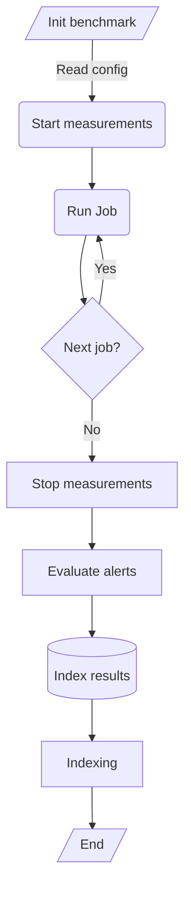

# Overview

Performing a benchmark using a kube-burner is relatively simple, however sometimes it's necessary to analyze and be able to react to some KPIs in order to validate a benchmark. That's the reason why kube-burner ships a [metric-collection](metrics.md) and [alerting](alerting.md) systems based on Prometheus expressions.

Kube-burner also ships an [indexing](indexing.md) feature that, in combination with the metric-collection and alerting features, can be used to analyze these KPIs in an external tool, such as [Grafana](https://grafana.com/) or similars.

With this we can describe the benchmark stages with the following diagram:

